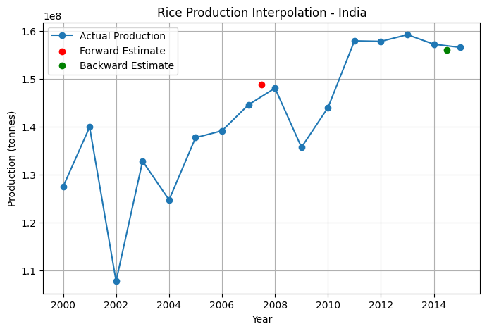

# Paddy Crop Production Prediction using Numerical Interpolation

## Project Overview

This project predicts the volume of paddy crop production for a selected year using classical Numerical Methods.

The system accepts a structured CSV dataset containing historical yearly production data. After preprocessing the dataset, Forward Interpolation and Backward Interpolation techniques are applied to approximate production values for a target year.

The predicted values are plotted against the actual dataset to visually analyze accuracy and trend alignment.

This project demonstrates the practical application of mathematical modeling in agricultural data analysis.

---

## Objectives

- Implement Newton Forward Interpolation
- Implement Newton Backward Interpolation
- Preprocess time series agricultural data
- Approximate crop production for a specific year
- Visualize predicted values against actual historical data

---

## Technologies Used

- Python  
- NumPy  
- Pandas  
- Matplotlib  
- Jupyter Notebook  

---

## Mathematical Methods Implemented

### Newton Forward Interpolation

Used when the target value is near the beginning of the dataset.

General form:

f(x) = f(x0) + uΔf(x0) + [u(u − 1) / 2!] Δ²f(x0) + ...

Where  
u = (x − x0) / h  

---

### Newton Backward Interpolation

Used when the target value is near the end of the dataset.

General form:

f(x) = f(xn) + u∇f(xn) + [u(u + 1) / 2!] ∇²f(xn) + ...

Where  
u = (x − xn) / h  

---

## Workflow

1. Load CSV dataset containing:
   - Year
   - Paddy production volume  

2. Clean and sort dataset chronologically  

3. Construct forward and backward difference tables  

4. Accept user defined target year  

5. Compute:
   - Forward interpolation prediction  
   - Backward interpolation prediction  

6. Plot:
   - Actual production data  
   - Forward interpolation prediction  
   - Backward interpolation prediction  

---

## Example Visualization

The graph below compares actual production data with predicted values from both interpolation methods.



---

## Repository Structure

```
Paddy-Production-Interpolation
│
├── data
│   └── sample_paddy_production.csv
│
├── notebooks
│   └── interpolation_analysis.ipynb
│
├── images
│   └── forward_backward_plot.png
│
├── requirements.txt
│
└── README.md
```

---

## Key Learning Outcomes

- Applied theoretical numerical methods to real agricultural datasets  
- Programmatically constructed difference tables  
- Implemented interpolation formulas from scratch  
- Visualized predictions using Python  
- Understood strengths and limitations of polynomial interpolation  

---

## Future Improvements

- Add absolute and relative error analysis  
- Compare with polynomial curve fitting  
- Convert into interactive web application using Streamlit  
- Extend to multi crop agricultural datasets  
- Automate method selection based on dataset range  

---

## Conclusion

This project bridges mathematical theory with real world agricultural data. It demonstrates how classical Numerical Methods can be implemented computationally to approximate crop production values and support analytical decision making.